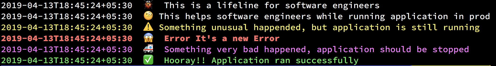
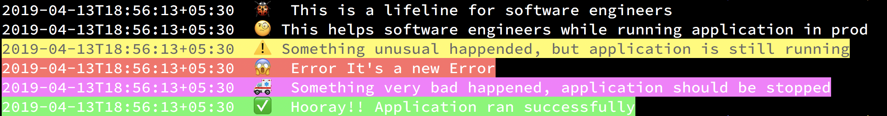

# emoji-logger

[](https://app.codacy.com/app/vaibhavsingh97/emoji-logger?utm_source=github.com&utm_medium=referral&utm_content=vaibhavsingh97/emoji-logger&utm_campaign=Badge_Grade_Settings)
[](https://goreportcard.com/report/github.com/vaibhavsingh97/emoji-logger)
[](https://godoc.org/github.com/vaibhavsingh97/emoji-logger)

Package logger is a custom logger package to output colorized emoji output to the standard output. The programmer should feel free to trace log as much of the code.

Nicely color-coded in development (when a TTY is attached, otherwise just plain text):




## Installation

To install emoji-logger package, you need to install Go and set your Go workspace first.

1. Download and install it:

```sh
$ go get -u github.com/vaibhavsingh97/emoji-logger
```

2. Import it in your code:

```sh
import "github.com/vaibhavsingh97/emoji-logger"
```

## Example

```go
package main

import (
    "fmt"

    logger "github.com/vaibhavsingh97/emoji-logger"
)

func main() {
    logger.Level = 10
    // Timestamp Disabled
    logger.TimeStamps = false
    // Color output enabled
    logger.Color = true

    err := fmt.Errorf("It's a new Error")

    logger.Debug("This is a lifeline for software engineers")
    logger.Info("This helps software engineers while running application in prod")
    logger.Warning("Something unusual happended, but application is still running")
    logger.Error("Error %v", err)
    // Note: this does **NOT** exit!
    logger.Critical("Something very bad happened, application should be stopped")
    logger.Success("Hooray!! Application ran successfully")
}

```

## Issues

You can report the bugs at the [issue tracker](https://github.com/vaibhavsingh97/emoji-logger/issues)

## License

Built with ♥ by Vaibhav Singh([@vaibhavsingh97](https://github.com/vaibhavsingh97)) under [Apache License 2.0](https://github.com/vaibhavsingh97/emoji-logger/blob/master/LICENSE)

You can find a copy of the License at <https://github.com/vaibhavsingh97/emoji-logger/blob/master/LICENSE>
